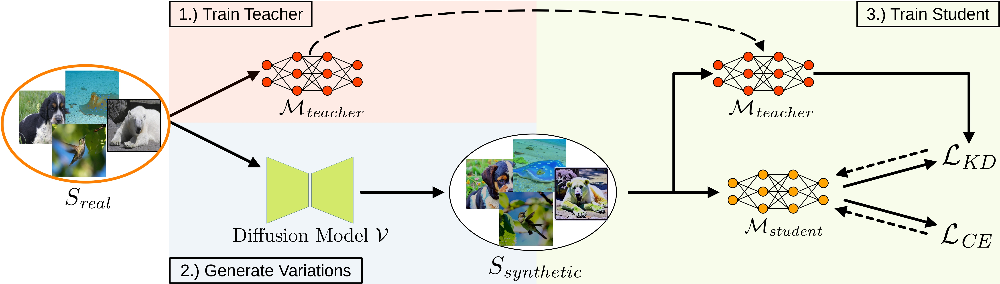

# Leveraging Diffusion-Based Image Variations for Robust Training on Poisoned Data

  <center>
  
  </center>

> **Abstract:**
> *Backdoor attacks pose a serious security threat for training neural networks as they surreptitiously introduce hidden functionalities into a model. Such backdoors remain silent during inference on clean inputs, evading detection due to inconspicuous behavior. However, once a specific trigger pattern appears in the input data, the backdoor activates, causing the model to execute its concealed function. Detecting such poisoned samples within vast datasets is virtually impossible through manual inspection. To address this challenge, we propose a novel approach that enables model training on potentially poisoned datasets by utilizing the power of recent diffusion models. Specifically, we create synthetic variations of all training samples, leveraging the inherent resilience of diffusion models to potential trigger patterns in the data. By combining this generative approach with knowledge distillation, we produce student models that maintain their general performance on the task while exhibiting robust resistance to backdoor triggers.*  


# Setup and Run Attacks

## Setup Docker Container
The easiest way to perform the attacks is to run the code in a Docker container. To build the Docker image run the following script:

```bash
docker build -t backdoor_defense  .
```

Our Dockerfile also allows storing a Weights & Biases API key directly in the image. For this, provide the API key as an argument when building the image:
```bash
docker build -t backdoor_defense --build-arg wandb_key=xxxxxxxxxx .
```

To create and start a Docker container run the following command from the project's root:

```bash
docker run --rm --shm-size 16G --name backdoor_1 --gpus '"device=all"' -v $(pwd):/workspace -it backdoor_defense bash
```

To specify individual GPUs, modify the option ```'"device=0,1,2"'``` accordingly. Detach from the container using ```Ctrl+P``` followed by ```Ctrl+Q```.


## Setup Weights & Biases
We rely on Weights & Biases for experiment tracking and result storage. A free account is needed at [wandb.ai](https://wandb.ai/site) to track the experiments. Note that we do not have any commercial relationship with Weights & Biases. 

To connect your account to Weights & Biases, run the following command and add your API key:
```bash
wandb init
```
You can find the key at [wandb.ai/settings](https://wandb.ai/settings). After the key was added, stop the script with ```Ctrl+C```. 

Our Dockerfile also allows storing the API key directly in the image. For this, provide the key as an argument when building the image:
```bash
docker build -t backdoor_defense --build-arg wandb_key=xxxxxxxxxx .
```


## Prepare Datasets
Datasets are expected in the [ImageFolder](https://pytorch.org/vision/stable/generated/torchvision.datasets.ImageFolder.html) style, i.e., all samples from a class are located in a separate folder. Training and test data are put in separate folders.

    ├── data       
        ├── dataset
            ├── training
                ├── class 1
                └── class 2
            └── test
                ├── class 1
                └── class 2


## Backdoor Attacks
Currently the following backdoor attacks are implemented:
- [BadNet](backdoor_attacks/patch_backdoor.py) with ```checkerboard```, ```white``` and ```black``` as trigger patches.
- [Blended](backdoor_attacks/blended_backdoor.py) with ```random``` noise patterns as trigger.

For training, various options are available. The ```target_idx``` defines the backdoor's target class. The ```poisoning_rate``` describes the share of training samples that are poisoned. Currently, samples from the target class can also be poisoned but keep their label. The option ```poison_first``` specifies if the data is first resized and poisoned and then augmented with additional transformations, or if the poisoning takes place after the training transformations. ```random_poisoning``` specifies if a fixed subset of the training data is poisoned (```false```) or if samples are poisoned on-the-fly (```true```) with respect to the ```poisoning_rate```.


## Generate Variations of Datasets
To generate image variations of the backdoored data, run 
```bash
python generate_variations.py -c=configs/defaults/variations.yaml
```
All parameters including the poisoning process and diffusion parameters are defined in the configuration file. The configuration will also be copied to the output folder. The parameters for ```backdoor``` and the ```seed``` should match those used to train the poisoned teacher to ensure the same samples are poisoned with the same parameters. When running the script for the first time, the weights of Versatile Diffusion are downloaded automatically, which might take a couple of minutes.


## Train Teacher and Student Models
Our code currently allows training all ResNet, ResNeSt, ResNeXt, DenseNet, and Inception-v3 models stated at [pytorch.org/vision/stable/models](https://pytorch.org/vision/stable/models.html). In addition, Vision Transformers (ViTs) from the [Timm](https://github.com/huggingface/pytorch-image-models/tree/main) package are supported. To add support for other models, you need to modify the method ```_build_model``` in ```models/classifier.py```, add the new model, and adjust its output layer's size.

To define the model and training configuration, you need to create a configuration file. Examples are provided in [configs/training](configs/training).

After a training configuration file has been created, run the following command to start the training of a teacher model with the specified configuration:
```bash
python train_teacher.py -c=configs/defaults/default_blended.yaml
```
After the optimization is performed, the results are automatically evaluated. All results together with the initial, optimized, and selected latent vectors are stored at WandB.

To train the student model, create a corresponding configuration file that includes the WandB run path of the already trained teacher model and run
```bash
python train_student.py -c=configs/defaults/training_student.yaml
```


## Citation
If you build upon our work, please don't forget to cite us.
```
@article{struppek2023leveraging,
    title={Leveraging Diffusion-Based Image Variations for Robust Training on Poisoned Data},    
    author={Lukas Struppek and Martin B. Hentschel and Clifton Poth and Dominik Hintersdorf and Kristian Kersting},
    year={2023},
    journal = {arXiv preprint},
    volume = {arXiv:TBD},
}
```

## Implementation Credits
Some of our implementations rely on other repos. We want to thank the authors for making their code publicly available. The main code base relies on [https://github.com/LukasStruppek/Plug-and-Play-Attacks](https://github.com/LukasStruppek/Plug-and-Play-Attacks). For license details, refer to the corresponding files in our repo. For more details on the specific functionality, please visit the corresponding repos.
